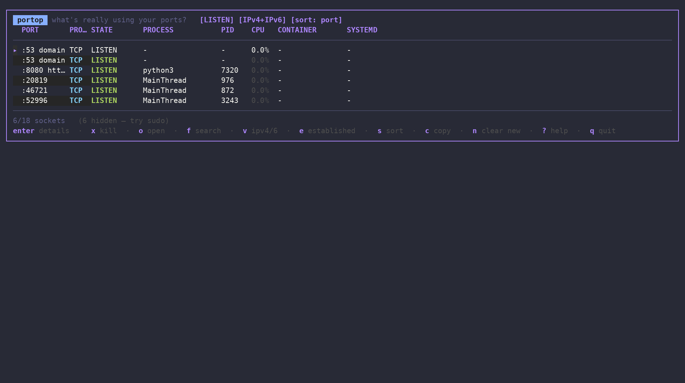

# portop 🔌

[](https://github.com/padovanl/portop/actions/workflows/ci.yml)
[](https://github.com/padovanl/portop/actions/workflows/release.yml)
[](https://github.com/padovanl/portop/releases/latest)
[](https://github.com/padovanl/portop/releases)
[](https://goreportcard.com/report/github.com/padovanl/portop)
[](go.mod)
[](LICENSE)

An **htop-style** terminal UI (TUI) that answers the question `ss`, `netstat`
and `lsof` only half-answer: not just *what's* bound to a port, but which
process, which systemd unit, which Docker container — and a one-key way to
open, inspect or kill it, live.

**[padovanl.github.io/portop →](https://padovanl.github.io/portop/)**


*Filtering to a port, checking who owns it, and the confirm-before-kill flow — all in real time.*

## ✨ Features

### 👀 See what's using your ports

- **Live, color-coded table**: `LISTEN`/`ESTABLISHED`/transient states,
  protocol and per-process CPU% (sampled like `top`) are all colored at a
  glance.
- **Well-known port names**: `:22` shows as `ssh`, `:443` as `https`, parsed
  straight from `/etc/services`.
- **systemd & Docker aware**: every row shows the owning `.service` unit and
  Docker container, resolved from cgroups — no D-Bus, no Docker SDK, no
  extra daemon.
- **Process detail view**: cmdline, executable, cwd, user, RSS, thread
  count, start time.
- **Adapts to your terminal width**: drops the least useful columns first
  so rows never wrap, down to 80 columns.

### ⚡ Act on it

- **Kill, with confirmation**: `k` then `y` (SIGTERM) or `f` (SIGKILL) —
  never a stray keypress away from killing the wrong thing.
- **Open in the browser**: `o` launches `http(s)://localhost:PORT` for the
  selected row.
- **Instant filter/search**: `f`, then start typing — matches port, process
  name or PID as you type.
- **Copy to clipboard**: `c` on the selected row.

### 🛎️ Stay ahead of surprises

- **New-port alerts**: a freshly opened listening port is highlighted the
  moment it appears, with an optional desktop notification
  (`--watch-new`).
- **Baseline drift detection**: `--save-baseline` now, `--diff` later (e.g.
  from a cron job or systemd timer) — exits non-zero the instant a port
  that wasn't in your baseline starts listening. Nothing else in this space
  does this as a first-class feature.
- **Scriptable**: `--json` prints a clean snapshot for piping into `jq`,
  dashboards, or your own tooling.

### 🎨 Make it yours

- **Live settings screen** (`,`): cycle through **12 built-in themes**
  (default, Dracula, Nord, Solarized, Gruvbox, Catppuccin, Tokyo Night,
  Monokai, Darcula, VS Code Dark+, Ubuntu, mono) with `←`/`→` — the whole
  UI re-skins as you move — and rebind any of 18 actions on the spot.
  Saved automatically; you never touch a file.
- **`config.yml`** is there too if you'd rather hand-edit it —
  `portop --init-config` writes a fully-commented template.

## 🆚 Why not just `ss -tlnp`?

You can. But you'll be doing all of this by hand, every time:

|                              | ss / netstat | lsof | bandwhich | portop |
|------------------------------|:---:|:---:|:---:|:---:|
| Live, refreshing view        | – | – | ✓ | ✓ |
| Kill from the UI              | – | – | – | ✓ |
| Open port in browser          | – | – | – | ✓ |
| systemd unit shown            | – | – | – | ✓ |
| Docker container shown        | – | – | – | ✓ |
| New-port alerts               | – | – | – | ✓ |
| Baseline drift / audit mode   | – | – | – | ✓ |
| Fuzzy filter/search           | – | – | – | ✓ |
| Themeable / remappable        | – | – | – | ✓ |

## 📥 Installation

Below, `<version>` means the release number **without** a leading `v` (a
`v0.1.0` tag produces `portop_0.1.0_linux_amd64.tar.gz`, not
`portop_v0.1.0_...`) — check the exact asset names on the [latest
release](https://github.com/padovanl/portop/releases/latest) rather than
guessing.

### One-line installer

```bash
curl -fsSL https://raw.githubusercontent.com/padovanl/portop/main/install.sh | sh
```

Detects your arch, verifies the release checksum, and installs to
`/usr/local/bin` (or `~/.local/bin` if that's not writable).

### `.deb` package (Debian/Ubuntu and derivatives)

```bash
curl -fLO https://github.com/padovanl/portop/releases/latest/download/portop_<version>_linux_amd64.deb
sudo dpkg -i portop_<version>_linux_amd64.deb
```

### Binary tarball (any Linux distro)

```bash
curl -fLO https://github.com/padovanl/portop/releases/latest/download/portop_<version>_linux_amd64.tar.gz
tar -xzf portop_<version>_linux_amd64.tar.gz
sudo install -m 755 portop /usr/local/bin/portop
```

### From source

```bash
go install github.com/padovanl/portop/cmd/portop@latest
```

## ⌨️ Usage

```bash
portop                 # launch the TUI (LISTEN + ESTABLISHED)
portop 8080             # launch the TUI pre-filtered on port 8080
portop redis            # launch the TUI pre-filtered on a process name
portop --listen          # show only listening (LISTEN) sockets
portop --json            # print one JSON snapshot and exit
portop --watch-new       # desktop-notify when a new port starts listening

portop --save-baseline   # remember which ports are currently listening
portop --diff            # compare live ports against the saved baseline
                          # (exit code 3 if something changed — great for cron)
```

Run `portop --help` for the full flag list.

> Rows with no process/PID are owned by another user (root's `docker-proxy`,
> `systemd-resolved`, ...) — the same limitation `lsof`/`ss -p` have without
> `sudo`. portop tells you when that's happening instead of leaving you to
> guess.

### Keybindings

These are the defaults — every one can be remapped, see
[Configuration](#%EF%B8%8F-configuration) below. The in-app `?` help always
reflects whatever's actually bound, including your overrides.

| Key       | Action                                          |
|-----------|--------------------------------------------------|
| `↑` `↓`   | move the cursor                                  |
| `g` `G`   | jump to top / bottom                             |
| `enter`   | process details                                  |
| `k`       | kill process (then `y`=SIGTERM, `f`=SIGKILL)     |
| `o`       | open `http(s)://localhost:PORT` in the browser   |
| `f` `/`   | filter/search by port, process or PID            |
| `v`       | toggle IPv4 / IPv6 / both                        |
| `e`       | show/hide `ESTABLISHED` connections              |
| `s`       | cycle sort column                                |
| `c`       | copy selected row to clipboard                   |
| `n`       | clear the new-port highlight                     |
| `r`       | refresh now                                      |
| `,`       | settings — live theme picker, remap any key      |
| `?`       | help                                             |
| `q`       | quit                                             |

## ⚙️ Configuration

Everything below is optional — portop works with no config file at all.

### Settings screen (recommended)

Press <kbd>,</kbd> inside portop:

- **Theme**: `←`/`→` cycles through it live — the whole UI re-skins as you
  move, no restart, no confirmation needed.
- **Keybindings**: pick any of the 18 actions, hit `enter`, then press
  whatever you want it bound to. `esc` cancels instead of capturing.
- **Reset keybindings to defaults** at the bottom of the list, one keypress.

Every change is written to `config.yml` immediately — you never have to
open the file yourself.

### Or hand-edit `config.yml`

```bash
portop --init-config   # writes a fully-commented template and exits
```

That writes to `~/.config/portop/config.yml` (pass `--config /path` to use a
different one). Example:

```yaml
theme: tokyo-night        # default | dracula | nord | solarized | gruvbox
                          # | catppuccin | tokyo-night | monokai | darcula
                          # | vscode | ubuntu | mono
show_established: false   # same as always passing --listen
refresh_interval: 1s

keybindings:
  kill: ["x"]
  quit: ["q", "ctrl+c"]
```

Command-line flags always win over `config.yml` when both set the same
thing. An unknown theme name or keybinding action fails fast with a message
telling you what's valid, instead of silently doing nothing. Fields the
settings screen doesn't touch (like `refresh_interval` above) are left
exactly as you wrote them.

## 🔧 How it works

portop reads `/proc/net/{tcp,tcp6,udp,udp6}` for the socket table and walks
`/proc/<pid>/fd` to match socket inodes to owning processes — the same
technique `lsof`/`ss` use, no root required beyond what's needed to see
other users' processes. systemd unit and Docker container association are
derived from each process's cgroup path, so no D-Bus or Docker SDK
dependency is needed; Docker container names are resolved via a couple of
read-only calls to the Docker Engine API over its unix socket when
available. Well-known port names come from parsing `/etc/services`, and
baseline diffing just snapshots the `LISTEN` set to a small JSON file under
your OS's config directory.

## ✅ Requirements

- **Linux only.** The scanner reads `/proc/net` directly — there's no
  `/proc` on macOS or Windows, so portop doesn't ship builds for either.
- `sudo`/root only if you want to see sockets owned by other users (e.g.
  root's `docker-proxy`) — portop runs fine without it, it just can't
  resolve those specific rows.
- Go 1.24+ only if building from source.
- A terminal that reports 256-color or truecolor support. A bare
  `TERM=xterm` (no `-256color` suffix) gets detected as a 16-color
  terminal, which downsamples every theme's colors and can make some hard
  to tell apart — `export TERM=xterm-256color` (or `COLORTERM=truecolor`)
  fixes it. This is common in minimal Docker/SSH sessions.

## 🤝 Contributing

Pull requests are welcome — see [CONTRIBUTING.md](CONTRIBUTING.md) for the
branch policy and PR requirements. Short version: open PRs against
`develop`, not `main`, and run `gofmt -l . && go vet ./... && go test ./...`
before pushing.

## 📄 License

MIT — see [LICENSE](LICENSE).

